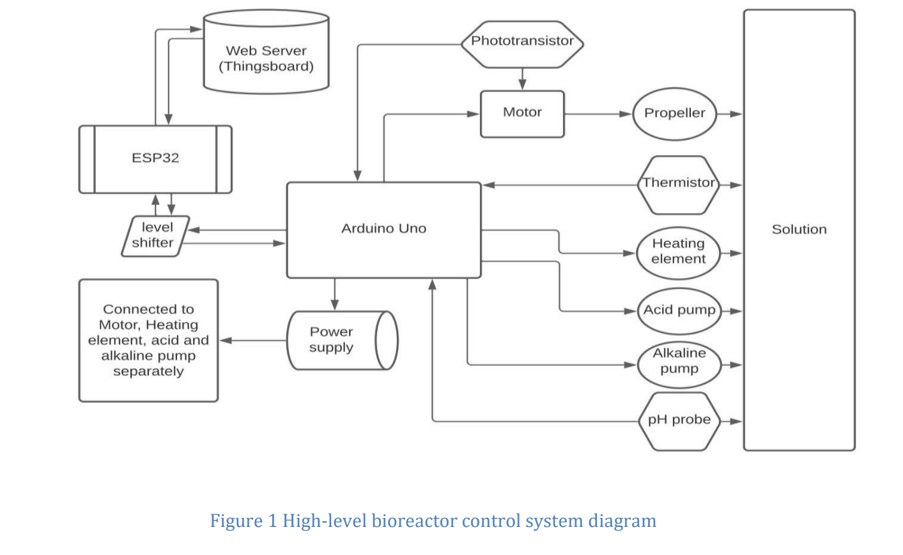

# TB Vaccine Bioreactor Control System

This project focuses on the design and implementation of a bioreactor control system for
tuberculosis (TB) vaccine production. TB is a serious infectious disease caused by
*Mycobacterium tuberculosis* and remains a major global health challenge, particularly in
low-income countries such as Uganda.

The system is intended to support yeast cultivation used in vaccine manufacturing by
precisely controlling and monitoring key bioreactor parameters.

## Project Objectives
- Maintain stable environmental conditions required for yeast growth
- Enable real-time monitoring and data logging
- Provide remote control via a web-based interface

## System Requirements
- **Temperature:** 25–35 °C (±0.5 °C)
- **pH level:** 3–7 (±0.2)
- **Stirring speed:** 500–1500 RPM (±20 RPM)

## System Architecture
The bioreactor control system is composed of four main subsystems:

1. **Heating Subsystem**  
   Thermistor and heating element for temperature regulation

2. **pH Control Subsystem**  
   pH probe with acid and alkaline pumps for pH adjustment

3. **Stirring Subsystem**  
   Motor, propeller, and phototransistor for speed feedback

4. **Connection and Control Subsystem**  
   Arduino Uno and ESP32 with a web server for monitoring, control, and data logging

   

## Overview
Sensor data from the heating, pH, and stirring subsystems are processed by the
connection/control subsystem. Based on this data, the system automatically adjusts
actuators to maintain target setpoints and logs all measurements with timestamps.
Remote access via a web interface enables real-time supervision and control of the
bioreactor.

This project was developed as part of a multidisciplinary engineering effort to support
TB vaccine production in resource-limited settings.
## Subsystem
### Heating Subsystem

The heating subsystem maintains the bioreactor temperature within the optimal
range of **25–35 °C (±0.5 °C)**.

- Temperature is measured using a **thermistor** connected in a voltage divider
- Sensor voltage is read by the Arduino via an analog input and calibrated using
  an external thermometer
- A **12V heating element** is controlled through a transistor
- The Arduino activates the heater by sending a digital HIGH signal to the transistor
- Control logic continuously adjusts heating based on real-time temperature readings
  
### pH Control Subsystem

The pH subsystem maintains solution pH within the range of **3–7 (±0.2)**.

- A pH probe provides real-time pH measurements
- Signal conditioning is performed using operational amplifiers to prevent loading effects
- Acid and alkaline pumps are controlled via transistors
- When pH deviates from the setpoint, the appropriate pump is activated
- Pumps are powered by a 6V supply and controlled through Arduino digital pins

### Stirring Subsystem

The stirring subsystem ensures uniform mixing at controlled speeds between
**500–1500 RPM (±20 RPM)**.

- DC motor driven through a transistor using PWM control
- Motor speed feedback provided by a phototransistor
- PWM output allows smooth acceleration to target speed
- Voltage divider used to supply the motor with the required 3V

### Connection and Control Subsystem

System monitoring and remote control are enabled via an Arduino Uno and ESP32.

- Arduino handles sensor data acquisition and actuator control
- ESP32 provides WiFi connectivity and communicates with Arduino via **I2C**
- ESP32 acts as the I2C master, requesting data from the Arduino
- Bidirectional level shifter used to match 5V (Arduino) and 3V (ESP32) logic levels
- Data is sent to the **ThingsBoard** web server for visualization and logging

